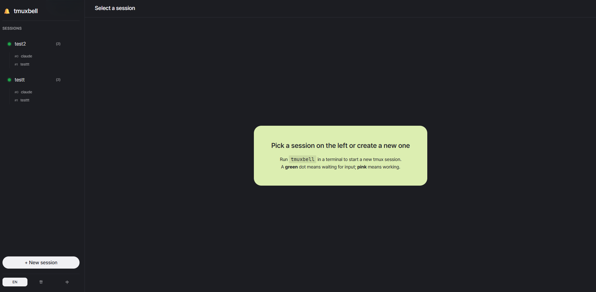

# 🔔 tmuxbell

> 🌐 [English](README.md) · [한국어](README.ko.md) · **中文**



我习惯将多个任务并行运行 —— Claude 会话、训练脚本、测试 watcher、
构建任务。把它们同时开着工作时,常常会忍不住切去看 "哪个跑完了",
而正在专注的工作反而被打断。

**tmuxbell** 是一个小型网页面板,会感知会话输出停下的那一刻并提示你。
会话正在输出时,侧边栏条目显示为粉色;停止的瞬间转为绿色。尚未查看的
会话上会出现 ✓ 标记,因此你可以专注于手头的工作,只在出现勾选时过去
看一眼即可。**如果你也有类似的困扰,希望它能帮你保持工作节奏,
从容、高效地推进事情。**

它适用于任何向终端输出的任务 —— Claude Code、`python train.py`、
`pytest --watch`、`cargo build` 等命令都以相同方式跟踪。

- `tmuxbell` 一行命令同时启动新的 tmux 会话和网页面板
- 侧边栏列出所有会话,颜色显示状态(等待 = 绿色,工作中 = 粉色)
- ✓ 标记 —— 会话完成时出现,查看后自动清除
- 真正的 `xterm.js` 浏览器终端 —— tmux 面板分割、快捷键、Claude TUI 全部正常工作
- 后端通过 `node-pty` 将 `tmux attach -t NAME` 经 WebSocket 转发

## 系统要求

- Linux
- Node.js 18+
- tmux 3.0+

## 安装

```bash
cd ~/tmuxbell/server
npm install
chmod +x ~/tmuxbell/bin/tmuxbell
# 将 ~/tmuxbell/bin 加入 PATH 或创建符号链接:
ln -sf ~/tmuxbell/bin/tmuxbell /usr/local/bin/tmuxbell
```

## 使用

```bash
tmuxbell              # 自动命名会话,运行 claude,面板自动启动
tmuxbell work         # attach 到 "work" 会话或新建,运行 claude
tmuxbell dev -- bash  # "dev" 会话里运行 bash 而不是 claude
tmuxbell --list       # 列出会话 + 输出面板 URL
```

浏览器: <http://localhost:7681>

### 默认命令

调用 `tmuxbell NAME` 时若不带 `-- CMD`,新会话会自动运行
[Claude Code](https://github.com/anthropics/claude-code)(`claude`)。
要更改全局默认值,设置 `TMUXBELL_DEFAULT_CMD` 环境变量;一次性覆盖请用
`-- CMD`。

## 环境变量

| 名称 | 默认值 | 说明 |
|---|---|---|
| `TMUXBELL_DIR` | `~/tmuxbell` | 安装目录 |
| `TMUXBELL_PORT` | `7681` | 面板端口 |
| `TMUXBELL_DEFAULT_CMD` | `claude` | 新会话自动运行的命令 |

## 活动状态规则

- 🟢 **idle**(绿色): pty 已停止输出约 1.5 秒 → 推测 Claude 已完成响应
- 🟣 **active**(品红): 输出正在持续流式产生
- ⚪ **unknown**(灰色): 尚未观察到的会话

单次孤立的输出(例如 tmux 的 15 秒状态栏刷新、shell 提示符重绘)会被过滤,
**不**计为活动。真正的流式响应会有许多紧密相邻的事件,因此会持续显示为
active。

## 开发

```bash
cd server
TMUXBELL_PORT=7681 node server.js
# 浏览器 http://localhost:7681
```

## Built on

tmuxbell 构建于以下开源项目的优秀工作之上:

- [tmux](https://github.com/tmux/tmux) — 终端多路复用
- [xterm.js](https://github.com/xtermjs/xterm.js) — 浏览器终端
- [node-pty](https://github.com/microsoft/node-pty) — Node 中的 PTY
- [express](https://github.com/expressjs/express), [ws](https://github.com/websockets/ws) — HTTP + WebSocket
- [Pretendard](https://github.com/orioncactus/pretendard), [JetBrains Mono](https://github.com/JetBrains/JetBrainsMono) — 字体
- [VoltAgent/awesome-design-md](https://github.com/VoltAgent/awesome-design-md) — 设计令牌

完整许可证与版权声明见 [`CREDITS.md`](./CREDITS.md)。

## 许可证

MIT。完整许可证文本见 [`LICENSE`](./LICENSE)。
